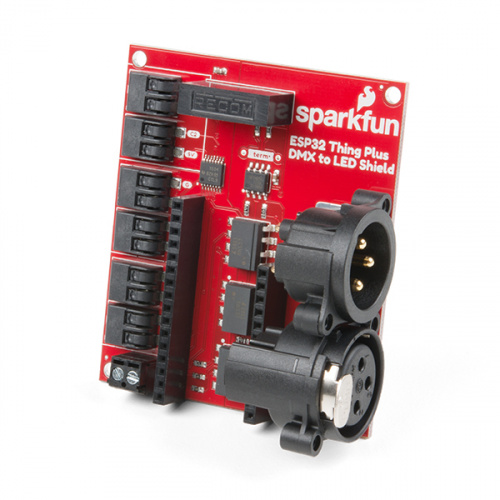

# sparkfun ESP32 Artnet to DMX Bridge

A high-performance Artnet to DMX bridge implementation for the sparkfun ESP32 DMX Shield.
It leverages the ESP32's dual-core architecture to ensure jitter-free DMX output while handling network traffic and debug logging on a separate core.



## 🚀 Key Features

* **Dual-Core Processing:**
    * **Core 0:** Handles WiFi stack, Art-Net UDP packet parsing, and Serial Debugging.
    * **Core 1:** Dedicated solely to the DMX timing and RS485 hardware communication.
* **WiFiManager:** No hardcoded WiFi credentials. The node starts its own Access Point (`Artnet-DMX-Node`) if no known network is found.
* **Visual Feedback:** Onboard Status LED (GPIO 13) acts as a data heartbeat.
* **Debug Mode:** Global toggle to monitor incoming DMX frames and system health via Serial.
* **Collision Safety:** Uses FreeRTOS Semaphores to prevent data corruption between cores.

---

## Installation

1. Upload the code to your ESP32 using ArduinoIDE or Platformio

3. Connect your DMX equipment to the shield

---

## How to Use

1. **Power On:** The LED will blink during the boot sequence.
2. **WiFi Config:** If not connected, look for a WiFi network named **Artnet-DMX-Node:** on your phone and configure your local SSID/Password.
3. **Send Data:** Point your Art-Net software (QLC+, MadMapper, etc.) to the ESP32's IP address on Universe 0.
4. **Enjoy:** The onboard LED will flicker when data is being received.

---

## Technical Details

- **DMX Channels**: Supports up to 512 channels (standard DMX universe)
- **Artnet Universe**: Configured for universe 0 (modifiable in code via `targetUniverse` variable)
- **Update Rate**: Real-time processing with minimal latency
- **Buffer Management**: Atomic operations ensure data integrity
- **Error Handling**: Automatic restart on WiFi connection failure

### Pin Mapping
| Function | ESP32 Pin | Note |
| :--- | :--- | :--- |
| **DMX TX** | GPIO 17 | Connect to DI on MAX485 |
| **DMX RX** | GPIO 16 | Connect to RO on MAX485 |
| **DMX EN** | GPIO 4 | Connect to DE/RE on MAX485 |
| **Status LED** | GPIO 13 | Internal SparkFun LED |

## Code Structure

- `setup()`: Initializes hardware, WiFi, and starts dual-core tasks
- `loop()`: Handles Artnet packet reception on Core 0
- `dmxOutputTask()`: Dedicated DMX output task running on Core 1
- `onDmxFrame()`: Callback function for incoming Artnet data

## Debugging
Toggle the global variable in the code to enable/disable Serial monitoring:
```cpp
bool debugEnabled = true; // Set to false for production use
```
When enabled, the node prints a DMX Snapshot of the first 16 channels every 5 seconds to the Serial Monitor (115200 Baud).

## Credits

This project is based on the [SparkFunDMX library](https://github.com/sparkfun/SparkFunDMX) and incorporates the [WiFiManager library](https://github.com/tzapu/WiFiManager) for WiFi configuration management, as well as the [ArtnetWifi library](https://github.com/rstephan/ArtnetWifi) for Artnet protocol handling.

Special thanks to:
- [SparkFun Electronics](https://github.com/sparkfun/SparkFunDMX) for the excellent DMX library
- [tzapu](https://github.com/tzapu/WiFiManager) for the WiFiManager implementation
- [rstephan](https://github.com/rstephan/ArtnetWifi) for the ArtnetWifi library

## License

This project is open source. Please refer to the individual library licenses for specific terms.

## Contributing

Feel free to submit issues and enhancement requests!

## Support

For technical support, please refer to the original library documentation:
- [SparkFunDMX Documentation](https://github.com/sparkfun/SparkFunDMX)
- [WiFiManager Documentation](https://github.com/tzapu/WiFiManager)
